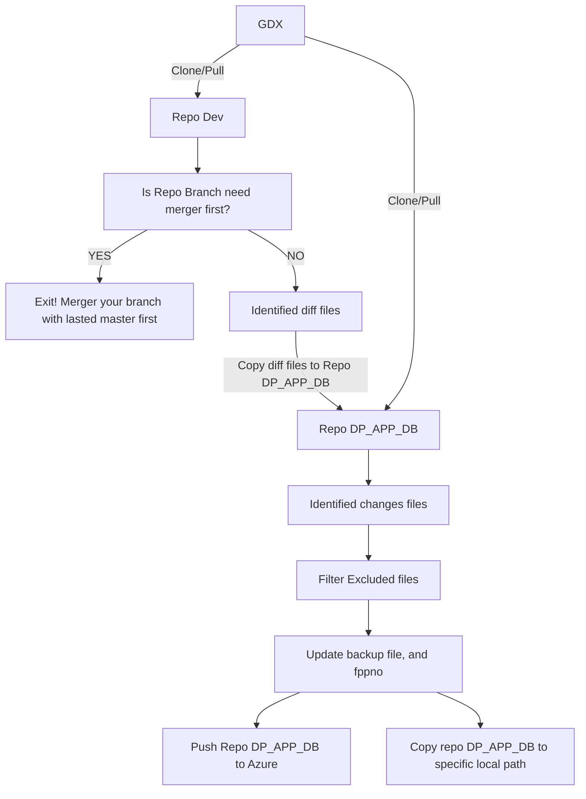

# Git Diff eXtraction 
[](https://github.com/vierilusen/git-diff-x)
[](https://github.com/vierilusen/git-diff-x/issues)
[](https://github.com/vierilusen/git-diff-x/releases/tag/v1.0)

The purpose of this project is to provide a CLI program that can be used internally by PT Bhinneka Life Indonesia. The program is designed to identify the differences between a repository branch and its master in the development repository. Once identified, it generates a diff that can be used to deploy changes automatically to the DP_APP_DB repository.

## Require
- [PHP 8.1+](https://www.php.net/releases/)
- [Git 2.0+](https://mirrors.edge.kernel.org/pub/software/scm/git/)

## Installation
Install GDX on Windows
1. Download cli zip file from this [release link](https://github.com/vierilusen/git-diff-x/releases/)
2. Extract zip file to C:\gdx
3. Settings your enviroment variable path to use gdx globally

## Flow System


## Usage/Examples
See all available commands and options:

```bash
C:\gdx> gdx
```

Usage:

```bash
C:\gdx> gdx generate:repo_name --option
```
List Repo Name:
- BLS_APP
- MORE COMING SOON!

List Options:
- --push (push to remote repo and create local folder DP)
- --push-only (just push to remote repo and don't create local folder DP)

Example:

```bash
C:\gdx> gdx generate:bls_app --push
```

