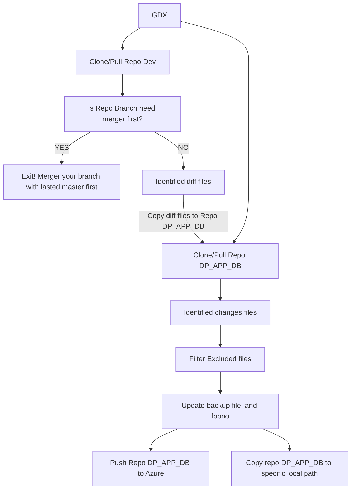

# Git Diff eXtraction 
[](https://github.com/vierilusen/git-diff-x)
[](https://github.com/vierilusen/git-diff-x/issues)
[](https://github.com/vierilusen/git-diff-x/releases/tag/v1.0)

This project is made only for internal personal use for the needs of PT Bhinneka Life Indonesia. A CLI program for identified diff beetwen repo branch to repo master in dev repo and generate diff for the needs deploy to DP_APP_DB repo automatically.

## Require
- [PHP 8.1+](https://www.php.net/releases/)
- [Git 2.0+](https://mirrors.edge.kernel.org/pub/software/scm/git/)

## Installation
Install GDX on Windows
1. Download cli zip file from this [release link](https://github.com/vierilusen/git-diff-x/releases/)
2. Extract zip file to C:\gdx
3. Settings your enviroment variable path to use gdx globally

## Flow System


## Usage/Examples
See all available commands and options:

```bash
C:\gdx> gdx
```

Usage:

```bash
C:\gdx> gdx generate:repo_name --option
```

Example:

```bash
C:\gdx> gdx generate:bls_app --push
```
